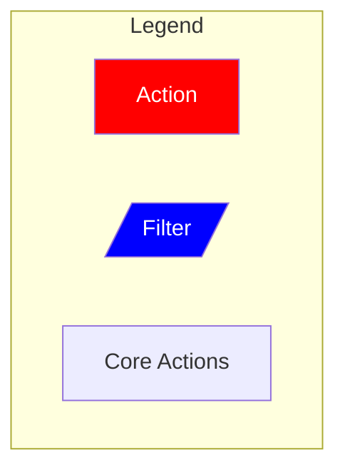
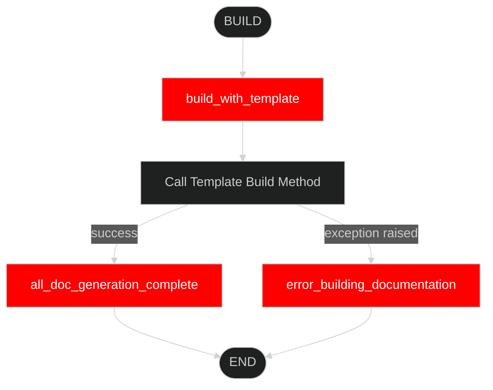

# Core

The `GraphicDocs` core engine parses your code before building readable documentation. It has four main components:

1. [**Initialization**](#initialization). When instantiating the `Core` class, it will initialize using the default configuration unless you provide it with your own config.

2. [**Plugins**](#plugins). Allows you to tap in to the process at various stages.

3. [**Templates**](#templates). The template is what takes the parsed information and tells the build script how to assemble it into an end product.

4. [**Build**](#building-documentation). This step actually creates the documentation.

----

## Initialization

This chart shows the core engine's logic process while generating documentation. Use it to help identify which filter or action your plugin needs to tie in to.

**Filters** take the input data, apply some kind of modification to it, then return the data in the same format it arrived in.

**Actions** will create side effects. They may take arguments if needed, but will return nothing on competion.

**Core Actions** are steps in the source code and cannot be modified with plugins or templates.

```mermaid
%%{init: { 'theme':'dark', 'sequence': {'useMaxWidth':false} } }%%
graph TD
    classDef action fill:red,color:white;
    classDef filter fill:blue,color:white;

    INIT([INIT]) --> initializedefaultstaticconfig[Initialize Config Settings]

    subgraph config [ ]
        initializedefaultstaticconfig --> lookforuserdefinedconfig
        lookforuserdefinedconfig{User Defined Config File?}
        overwritedefaultconfig[Overwrite From File]
        searchworkingdir[Search for Config File in Working Directory]
        usedefaultconfigsettings[Use Default Config Settings]
        readsetting[Read Next User Setting]
        addnewsetting[Add Setting]
        moresettings{More Settings?}
        configloaded([Configuration Settings Valid])
        
        lookforuserdefinedconfig --> |not specified| searchworkingdir
        searchworkingdir --> |found| readsetting
        searchworkingdir --> |not found| usedefaultconfigsettings --> configloaded
        lookforuserdefinedconfig --> |specified|readsetting
        readsetting --> |recognized and valid|overwritedefaultconfig --> moresettings
        readsetting --> |recognized but invalid|usedefault[Use Default] --> moresettings
        readsetting --> |unrecognized|addnewsetting --> moresettings
        moresettings --> |yes|readsetting
        moresettings --> |no|configloaded
        readsetting --> |All settings validated|configloaded

    end

    configloaded --> register_core_hooks[Register Core Hooks]
    register_core_hooks --> loadpluginlist
    subgraph plugins [ ]
        loadpluginlist[Load Plugins from Config]
        read_next_plugin[/read_next_plugin/]:::filter
        pluginabsolutepath{Absolute Path?}
        no_plugins_listed:::action
        all_plugins_loaded:::action
        plugin_dirA[Search for Plugin in Working Directory]
        plugin_dirB[Search for Plugin in Config Directory]
        plugin_dirC[Search for Plugin in System Path]
        plugin_dirD[Search for Plugin in GraphicDocs Plugin Directory]
        load_plugin[Load Plugin]
        plugin_not_found[plugin_not_found]:::action
        error_loading_plugin[error_loading_plugin]:::action
        moreplugins{More Plugins?}

        loadpluginlist --> |plugins requested in config|read_next_plugin
        loadpluginlist --> |no plugins listed|no_plugins_listed --> all_plugins_loaded

        read_next_plugin --> pluginabsolutepath
        pluginabsolutepath --> |yes|load_plugin
        pluginabsolutepath --> |no|plugin_dirA
        plugin_dirA --> |not found|plugin_dirB
        plugin_dirA --> |found|load_plugin
        plugin_dirB --> |not found|plugin_dirC
        plugin_dirB --> |found|load_plugin
        plugin_dirC --> |not found|plugin_dirD
        plugin_dirC --> |found|load_plugin
        plugin_dirD --> |not found|plugin_not_found
        plugin_dirD --> |found|load_plugin
        load_plugin --> |success| plugin_loaded:::action --> moreplugins
        load_plugin --> |fail|error_loading_plugin --> moreplugins
        plugin_not_found --> moreplugins

        moreplugins --> |yes| read_next_plugin
        moreplugins --> |no| all_plugins_loaded
    end

    all_plugins_loaded --> init[init]:::action
    init --> loadtemplate

    subgraph template [Load Template]
        loadtemplate[Load Template]
        get_template_path_from_config[/get_template_path_from_config/]:::filter
        templateabsolutepath{Absolute Path?}
        load_template[Load Template as Reference]
        template_dirA[Search for Template in Working Directory]
        template_dirB[Search for Template in Config Directory]
        template_dirC[Search for Template in System Path]
        template_dirD[Search for Template in GraphicDocs Directory]
        error_loading_template:::action
        template_not_found[template_not_found]:::action
        usedefaulttemplate[Use Default Template]

        loadtemplate --> get_template_path_from_config
        get_template_path_from_config --> |custom path specified|templateabsolutepath
        templateabsolutepath --> |yes|load_template
        templateabsolutepath --> |no|template_dirA
        template_dirA --> |not found|template_dirB
        template_dirA --> |found|load_template
        template_dirB --> |not found|template_dirC
        template_dirB --> |found|load_template
        template_dirC --> |not found|template_dirD
        template_dirC --> |found|load_template
        template_dirD --> |not found|template_not_found
        template_dirD --> |found|load_template

        load_template --> |error|error_loading_template
        error_loading_template --> usedefaulttemplate
        template_not_found --> |no|usedefaulttemplate
        get_template_path_from_config --> |no path specified|no_template_specified:::action
        no_template_specified --> usedefaulttemplate
    end
    
    finished_loading_template:::action
    load_template --> |success|finished_loading_template
    usedefaulttemplate --> finished_loading_template

    next_parsing_target[/next_parsing_target/]:::filter
    moreparsingtargets{More Parsing Targets?}

    finished_loading_template --> parsepython[Check for Core Config Source Target]

    subgraph prepare [ ]
        parsepython --> |at least one target specified|next_parsing_target
        next_parsing_target --> attempt_load[Attempt to Load Module]
        attempt_load --> |not module|unable_to_load_module:::action
        attempt_load --> |success|parse[Parse Module]

        parse --> |success|parsed_module:::action --> moreparsingtargets
        parse --> |unhandled exception|unable_to_parse:::action
        moreparsingtargets --> |no|parsing_complete:::action
        parsepython --> |no targets provided|no_parsing_targets_specified:::action
        moreparsingtargets --> |yes|next_parsing_target
    end

    unable_to_load_module --> core_loaded:::action
    unable_to_parse --> core_loaded
    parsing_complete --> core_loaded
    no_parsing_targets_specified --> core_loaded
```

----

## Plugins

`GraphicDocs` takes inspiration from the WordPress system in that it uses a series of hooks to execute actions and filters both while parsing code and generating readable documentation. You can write your own plugin to tap in to the initialization and build sequences to provide you more customized control over the process without having to dive in to the inner core code workings.

Using the filter and action hooks, you can create plugins to tie in to them and modify the core execution processes without editing the core code.

- Filters take input data and return a modified form of it.
- Actions can take arguments (but do not have to), and serve as milestones to run actions at various points.

----

## Templates

The template gets run at the `build_with_template` action near the end. This takes the parsed output and builds the documentation files. By default, `GraphicDocs` will use the built in Markdown generating template.

Available built-in templates:

- `graphic_md` (_default_): A Markdown based template.

----

## Building Documentation

After the core object initializes, the `.build()` script generates output.

