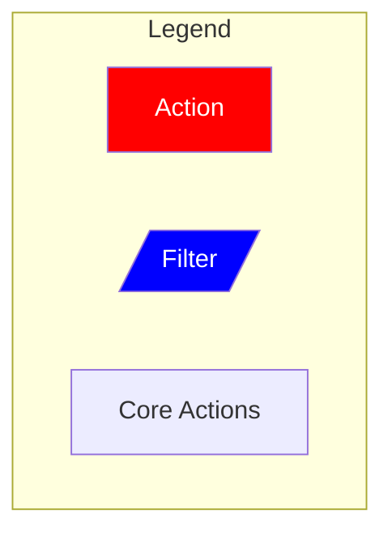

# Core

The `GraphicDocs` core engine is inspired by the WordPress system. It uses a series of hooks to execute actions and filters both while parsing code and generating readable documentation.

## Legend

**Filters** take the input data, apply some kind of modification to it, then return the data in the same format it arrived in.

**Actions** will create side effects. They may take arguments if needed, but will return nothing on competion.

**Core Actions** are steps in the source code and cannot be modified with plugins or templates.

## Plugins

Using the filter and action hooks, you can create plugins to tie in to them and modify the core execution processes without editing the core code.

## Templates

The template gets run at the `build_with_template` action near the end. This takes the output object returned by `final_parsed_object` and builds the documentation files. By default, `GraphicDocs` will use the built in Markdown generating template.

## Flow Chart

This chart shows the core engine's logic process while generating documentation. Use it to help identify which filter or action your plugin needs to tie in to.

```mermaid
 %%{init: { 'theme':'dark', 'sequence': {'useMaxWidth':false} } }%%
graph TD
    classDef action fill:red,color:white;
    classDef filter fill:blue,color:white;

    START([START]) --> registercorehooks[Register Core Hooks]
    registercorehooks --> getdefaultstaticconfig[/Get Default Config Settings/]
    getdefaultstaticconfig --> lookforuserdefinedconfig

    subgraph config [ ]
        
        lookforuserdefinedconfig{User Defined\n Config File?}
        overwritedefaultconfig[Overwrite\n Default Config\n From File]
        searchworkingdir[Search for Config File in Working Directory]
        usedefaultconfigsettings[Use Default Config Settings]
        readsetting[Read Next User Setting]
        isvalidsetting{Valid\n Setting?}
        addnewsetting[Add Setting]
        moresettings{More\n Settings?}
        configloaded[/Return Valid Config Settings/]
        
        lookforuserdefinedconfig --> |not specified| searchworkingdir
        searchworkingdir --> |found| readsetting
        searchworkingdir --> |not found| usedefaultconfigsettings --> configloaded
        lookforuserdefinedconfig --> |specified|readsetting
        readsetting --> |recognized|isvalidsetting
        isvalidsetting --> |valid|overwritedefaultconfig --> moresettings
        isvalidsetting --> |invalid|usedefault[Use Default] --> moresettings
        readsetting --> |unrecognized|addnewsetting --> moresettings
        moresettings --> |yes|readsetting
        moresettings --> |no|configloaded
        readsetting --> |All settings validated|configloaded

    end
    
    configloaded --> loadpluginlist
    subgraph plugins [ ]
        loadpluginlist[/Get Plugin List From Config/]
        read_next_plugin[/read_next_plugin/]:::filter
        pluginabsolutepath{Absolute\n Path?}
        all_plugins_loaded[all_plugins_loaded]:::action
        plugin_dirA[Search for Plugin in Working Directory]
        plugin_dirB[Search for Plugin in Config Directory]
        plugin_dirC[Search for Plugin in GraphicDocs Plugin Directory]
        plugin_path_before_loading[plugin_path_before_loading]:::filter
        load_plugin[load_plugin]:::action
        plugin_not_found[plugin_not_found]:::action
        pluginloaded{Plugin\n Loaded?}
        error_loading_plugin[error_loading_plugin]:::action
        moreplugins{More\n Plugins?}

        loadpluginlist --> |plugins requested in config|read_next_plugin
        loadpluginlist --> |no plugins listed|all_plugins_loaded
        read_next_plugin --> pluginabsolutepath
        pluginabsolutepath --> |yes|plugin_path_before_loading
        pluginloaded --> |success|moreplugins
        pluginloaded --> |fail|error_loading_plugin --> moreplugins
        pluginabsolutepath --> |no|plugin_dirA
        plugin_dirA --> |not found|plugin_dirB
        plugin_dirA --> |found|plugin_path_before_loading
        plugin_dirB --> |not found|plugin_dirC
        plugin_dirB --> |found|plugin_path_before_loading
        plugin_dirC --> |not found|plugin_not_found
        plugin_dirC --> |found|plugin_path_before_loading
        plugin_path_before_loading --> load_plugin --> pluginloaded
        plugin_not_found --> moreplugins

        moreplugins --> |yes| read_next_plugin
        moreplugins --> |no| all_plugins_loaded
    end

    all_plugins_loaded --> init[init]:::action
    init --> core_loaded:::action
    core_loaded --> get_template_path_from_config
    subgraph template [Load Template]
        get_template_path_from_config[/get_template_path_from_config/]:::filter
        templateabsolutepath{Absolute\n Path?}
        template_path_before_loading[/template_path_before_loading/]:::filter
        load_template[load_template]:::action
        template_dirA[Search for Template in Working Directory]
        template_dirB[Search for Template in Config Directory]
        template_dirC[Search for Template in Doc Generator Directory]
        error_loading_template[error_loading_template]:::action
        template_not_found[template_not_found]:::action
        template_loaded[template_loaded]:::action
        usedefaulttemplate[Use Default Template]
        finished_loading_templates[finished_loading_templates]:::action

        get_template_path_from_config --> |custom path specified|templateabsolutepath
        templateabsolutepath --> |yes|template_path_before_loading
        templateabsolutepath --> |no|template_dirA
        template_dirA --> |not found|template_dirB
        template_dirA --> |found|template_path_before_loading
        template_dirB --> |not found|template_dirC
        template_dirB --> |found|template_path_before_loading
        template_dirC --> |not found|template_not_found
        template_dirC --> |found|template_path_before_loading

        template_path_before_loading --> load_template
        load_template --> |success|template_loaded
        load_template --> |error|error_loading_template
        template_loaded --> finished_loading_templates
        error_loading_template --> usedefaulttemplate
        template_not_found --> |no|usedefaulttemplate
        get_template_path_from_config --> |no path specified|no_template_specified:::action
        no_template_specified --> usedefaulttemplate
        usedefaulttemplate --> finished_loading_templates
    end

    finished_loading_templates -->get_parsing_list

    subgraph parseCode [ ]
        get_parsing_list[/get_parsing_list/]:::filter
        next_parsing_target[/next_parsing_target/]:::filter
        attempt_parse_pymodule:::action
        attempt_parse_pyclass:::action
        attempt_parse_pyfunction:::action
        unable_to_parse:::action
        parsing_complete:::action
        moreparsingtargets{More Parsing\n Targets?}
        final_parsed_object[/final_parsed_object/]:::filter

        after_parsing_result[/after_parsing_result/]:::filter

        get_parsing_list --> |no targets provided|no_parsing_targets_specified:::action
        get_parsing_list --> |at least one target specified|next_parsing_target
        next_parsing_target --> attempt_parse_pymodule
        attempt_parse_pymodule --> |not module|attempt_parse_pyclass
        attempt_parse_pymodule --> |success|after_parsing_result
        attempt_parse_pyclass --> |not class|attempt_parse_pyfunction
        attempt_parse_pyclass --> |success|after_parsing_result
        attempt_parse_pyfunction --> |success|after_parsing_result
        attempt_parse_pyfunction --> |fail|unable_to_parse
        after_parsing_result --> moreparsingtargets
        moreparsingtargets --> |no|parsing_complete
        moreparsingtargets --> |yes|next_parsing_target
        no_parsing_targets_specified --> parsing_complete
        unable_to_parse --> moreparsingtargets
        parsing_complete --> final_parsed_object

    end

    final_parsed_object --> build_with_template:::action
    build_with_template --> all_doc_generation_complete:::action
    all_doc_generation_complete --> END

    END([END])
```

