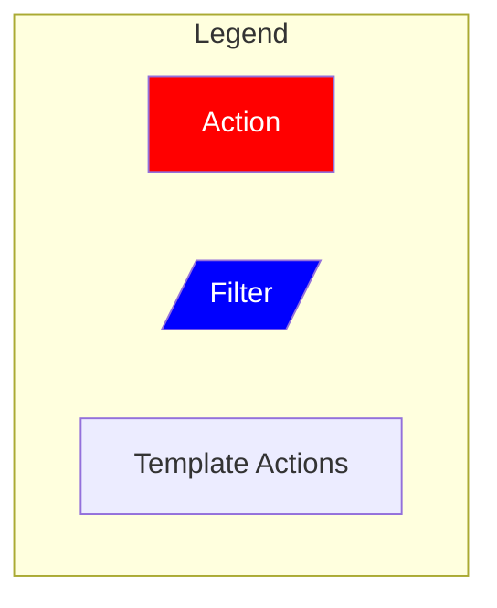
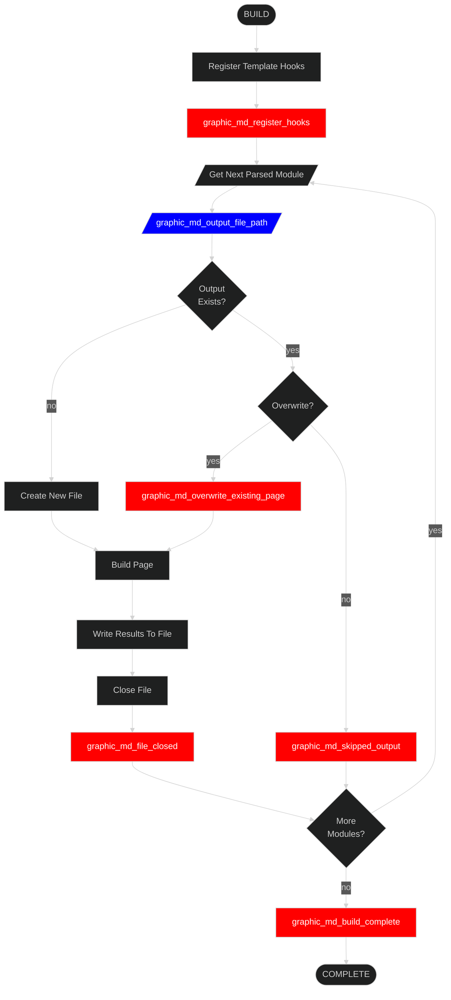

# Graphic MD Template

## About

This template will build a single Markdown file for each module in the parsed source. It outputs all parsed modules into the same output folder regardless of the input heirarchy.

GraphicDocs uses this template by default if you do not provide a different valid template. As the default, it offers limited hooks to tap into.

## Flowchart

When the core's `build()` method executes, it follows the program logic below.

